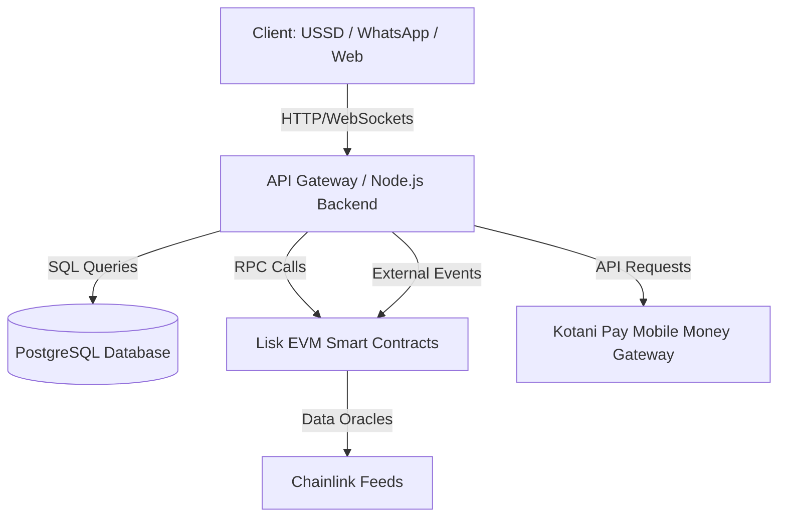

# Architecture Overview: BikkoChain

This document details the software architecture, engineering stack, integration endpoints, and data flows for BikkoChain.

---

## 🛠️ Technology Stack

### Frontend
* **Next.js (v14/15 App Router):** Used for public web portals and administrative dashboards (cooperatives/lenders).
* **TypeScript:** Strict compilation config for robust UI state and safety.
* **Tailwind CSS & Vanilla CSS:** Core design systems, utilizing modern responsive layout conventions.
* **shadcn/ui (Radix UI):** Pre-built accessible components tailored to custom styles.

### Backend Services
* **Node.js with Express/Fastify (TypeScript):** Handles user profiles, USSD session state, WhatsApp bot logic, verification workflows, and database records.
* **PostgreSQL:** Reliable database for storing user registrations, transaction logs, USSD state sessions, and caching chain events.
* **Prisma / Drizzle ORM:** Type-safe database client.

### Blockchain & Smart Contracts
* **Network:** Lisk Network (EVM-compatible Layer 2, low fees, fast confirmation times).
* **Solidity:** Standard language for loan escrow and yield tokenization smart contracts.
* **Hardhat / Foundry:** Development, compilation, testing, and deployment framework.
* **Ethers.js / Viem:** Blockchain communication clients in backend and frontend code.

### Third-Party Integrations
* **Kotani Pay:** Connects Lisk stablecoin escrows to Ghanaian Mobile Money (MTN MoMo, Telecel Cash, AT Money) via REST APIs.
* **Chainlink:** Oracle feeds to retrieve market prices of cocoa and coffee, plus weather oracle integrations for crop failure risk adjustment.

---

## 🧱 Key Architectural Layers

### 1. The Real-World Asset (RWA) Tokenization Layer
Every harvest contract entered into by a farmer is validated by a co-op supervisor. The supervisor issues a digital certificate, which is minted as an ERC-721/ERC-1155 token on Lisk. This token acts as the loan collateral.
* **Collateral NFT (ERC-721):** Represents a specific batch of future harvests containing properties such as weight, estimated grade, farmer ID, and target delivery date.

### 2. The Lending & Escrow Engine
* **LoanEscrow Contract:** Manages the locking of Collateral NFTs, funding from liquidity pools, automated disbursement triggers, and repayment reconciliation.
* **Interest Engine:** Calculates linear interest based on duration and risk profile.

### 3. The Middleware (USSD & WhatsApp Gateway)
* Since farmers often use basic phones, a backend service processes USSD requests (using providers like Africa's Talking) and WhatsApp messages (using Twilio or Meta WhatsApp Business API).
* These inputs map to state machines in the Node.js backend, which invoke blockchain transactions on behalf of the farmer using custodian/relayer wallets.

---

## 🚀 Infrastructure & CI/CD

### Environments
* **Development:** Localhost, Lisk Sepolia Testnet, Local SQLite/PostgreSQL.
* **Staging:** Vercel (Frontend), Render/AWS (Backend APIs), Lisk Sepolia Testnet, Managed PostgreSQL.
* **Production:** Vercel, Render/AWS (Auto-scaling), Lisk Mainnet, High-availability PostgreSQL.

### CI/CD Pipelines (GitHub Actions)
* **Pre-commit checks:** Linting, formatting, TS validation.
* **Test suites:** Automated frontend, backend, and smart contract unit tests on pull requests.
* **Automated Deployments:**
  * Frontend: Merges to `main` auto-deploy to Vercel.
  * Backend: Merges to `main` trigger Docker builds deploying to Render.
  * Contracts: Trigger deployments via automated scripts, logging contract addresses to GitHub Secrets.
